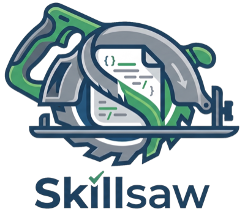

<div class="hero" markdown>

{ width="200" }

# Keep your skills sharp.

<p class="hero-subtitle" markdown>
40+ rules catch weak language, contradictions, attention dead zones, and structural issues — then auto-fix them.
</p>

<p class="hero-badges" markdown>
[](https://pypi.org/project/skillsaw/)
[](https://github.com/stbenjam/skillsaw/actions/workflows/test.yml)
[](https://opensource.org/licenses/Apache-2.0)
</p>

<p class="hero-install"><code>uvx skillsaw</code></p>

[Get Started](getting-started.md){ .md-button .md-button--primary }
[View Rules](rules/index.md){ .md-button }

</div>

<div class="demo-frame">
<script src="https://asciinema.org/a/1259880.js" id="asciicast-1259880" async data-autoplay="true" data-loop="true" data-speed="1.5" data-theme="dracula"></script>
<noscript><p>▶️ <strong><a href="https://asciinema.org/a/1259880">Watch the onboarding demo</a></strong> — see an AI agent grade, fix, and configure a repo from scratch.</p></noscript>
</div>

---

## Features

<div class="grid cards" markdown>

-   :brain:{ .lg .middle } **Content Intelligence**

    ---

    [Research-backed](research.md) rules that catch weak language, tautological instructions,
    attention dead zones, embedded secrets, contradictions, and more.

-   :wrench:{ .lg .middle } **Agent-Friendly Fixes**

    ---

    Deterministic autofixes via `skillsaw fix`, plus how-to-fix guidance in
    `skillsaw explain` that coding agents use to resolve the rest.

-   :mag:{ .lg .middle } **Context-Aware**

    ---

    Auto-detects repo type and instruction formats: CLAUDE.md, AGENTS.md, Cursor, Copilot,
    Gemini, Kiro, and more.

-   :triangular_ruler:{ .lg .middle } **50 Rules**

    ---

    Validates structure, metadata, commands, cross-file consistency, context budget, and
    content quality.

-   :building_construction:{ .lg .middle } **Scaffolding**

    ---

    `skillsaw add` generates plugins, skills, commands, agents, and hooks with best-practice
    structure.

-   :memo:{ .lg .middle } **Documentation**

    ---

    `skillsaw docs` generates HTML or Markdown documentation for your plugins and marketplaces.

-   :electric_plug:{ .lg .middle } **Extensible**

    ---

    Custom rules, banned patterns, per-rule thresholds — tailor skillsaw to your project.

-   :robot:{ .lg .middle } **CI-Ready**

    ---

    GitHub Action with inline PR comments, deduplication, and automatic thread resolution.

-   :zap:{ .lg .middle } **Version-Gated**

    ---

    New rules gated behind config versions — no surprises on upgrade.

</div>

---

## Quick Start

```bash
# Lint current directory (no install required)
uvx skillsaw

# Fix structural issues automatically
skillsaw fix

# Content quality issues? Your coding agent can fix them —
# every violation points to `skillsaw explain` guidance
```

[:octicons-arrow-right-24: Full installation guide](getting-started.md)
